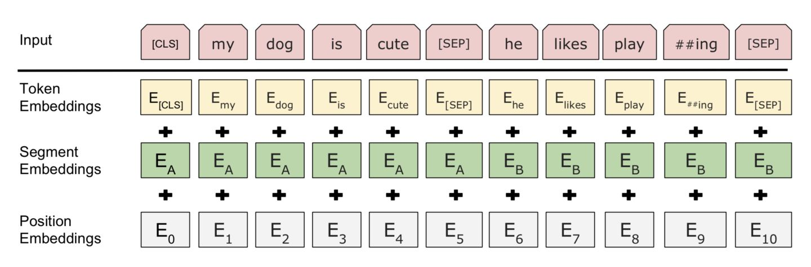
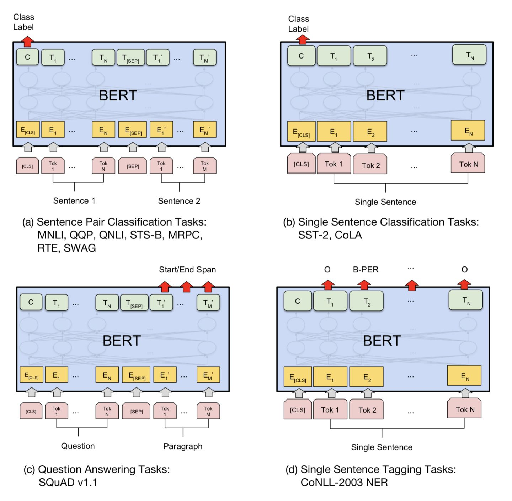

来源于2018年Google的论文[Bidirectional Encoder Representations from Transformers](https://arxiv.org/pdf/1810.04805.pdf)

 

模型架构是一个多层双向Transformer编码器。BERT有两种模型大小，分别是（base，L=12, H=768, A=12, Total Parameters=110M）和（large，L=24, H=1024, A=16, Total Parameters=340M）。

 

### Model Input

* 为了能够同时表示单句子和句子对，多句子(例如QA中的Q/A)需要进行拼接作为单个句子，用segment embedding和[SEG]来进行区分
* 句子第一个token总是有特殊含义，例如分类问题中是类别，如果不是分类问题那么就忽略
* 三个embedding进行sum得到输入的向量

### Pre-train
* Masked LM
     
    为了训练一个深度双向表征，作者简单的随机mask一些百分比的输入tokens，然后预测那些被mask掉的tokens。mask掉的tokens对应的最后的隐藏层向量喂给一个输出softmax，像在标准的LM中一样。在实验中，作者为每个序列随机mask掉了15%的WordPiece tokens。
     
     
    尽管这允许作者获得双向预训练模型，其带来的负面影响是在预训练和微调模型之间创造了不匹配，因为[MASK]符号不会出现在微调阶段。所以要想办法让那些被mask掉的词的原本的表征也被模型学习到，所以这里作者采用了一些策略。
     
     
    会随机选择句子中15%的tokens位置进行mask。
    - 80% 的时间：用[MASK]替换目标单词，例如：my dog is hairy --> my dog is [MASK] 。
    - 10% 的时间：用随机的单词替换目标单词，例如：my dog is hairy --> my dog is apple 。
    - 10% 的时间：不改变目标单词，例如：my dog is hairy --> my dog is hairy 。 （这样做的目的是使表征偏向于实际观察到的单词。） 

    duplicate数据10倍，所以每个句子以10种不同的方式mask，喂给40个epochs。因此在训练过程中，对于每个sentence，模型会见到四次同样的mask方式。

* Next Sentence Prediction
     
    为了训练一个可以理解句子间关系的模型，作者为一个二分类的下一个句子预测任务进行了预训练，这些句子对可以从任何单语言的语料中获取到。
     
    当为每个预测样例选择一个句子对A和B，50%的时间B是A后面的下一个句子(标记为IsNext)， 50%的时间B是语料库中的一个随机句子(标记为NotNext)。

### Fine-tuning 
针对sequence-level classification problem(例如情感分析)，取第一个token的输出表示，喂给一个softmax层得到分类结果输出；对于token-level classification(例如NER)，取所有token的最后层transformer输出，喂给softmax层做分类。

