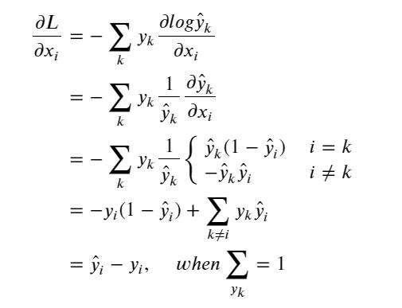

### softmax梯度推导

 

,&i=j\\\\-\frac{e^{x_i}e^{x_j}}{\sum^2}=-\hat{y}_i\hat{y}_j,&i\neq{j}\\\\\end{cases})

 
化简成矩阵形式： 

}-\hat{y}{\hat{y}}^\top\in{\mathbb{R}}^{d\times{d}})

 

-------------

### CrossEntropy的梯度推导

 

