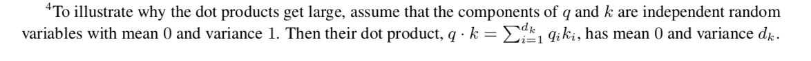

### Scaled Dot-Product Attention
=softmax(\frac{QK^T}{\sqrt{d_k}})V)  

#### softmax归一化的特性

对于输入向量，softmax函数将其归一化到一个概率分布。如果输入的数量级很大（每个元素都很大），那么具有最大值的位置会非常接近于1。
 
假设
* a=1时，
* a=10时，
* a=100时，
 

[大佬](https://www.zhihu.com/question/339723385/answer/782509914)给出了此种情况下的分布图，表明在数量级较大时，softmax将几乎全部的概率分布都分配给了最大值对应的标签。

另外根据[softmax梯度的推导]()，可得： 
}-\hat{y}{\hat{y}}^\top\in{\mathbb{R}}^{d\times{d}})

 

当输入很大时，会成为one-hot向量，梯度会消失为0。

#### 维度的根号来缩放

 

假设向量和的各个分量是互相独立的随机变量，均值是0，方差是1，那么点积的均值是0，方差是。

根据[大佬](https://www.zhihu.com/question/339723385/answer/782509914)的推导，两个均值为0方差为1的随机变量的乘积的均值为0，方差也为1。

 

由于中每个元素是个随机变量pair的乘积和，所以变换之后的每个元素服从均值为0，方差为的分布。

 

为了将方差稳定到1，所以每个元素要除以。

参考资料：
* [transformer中的attention为什么scaled?](https://www.zhihu.com/question/339723385/answer/782509914)