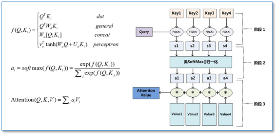

来自NIPS 2017的一篇文章[Attention Is All You Need](https://arxiv.org/pdf/1706.03762.pdf)

### Attention
* 将query和每个key进行相似度计算得到权重，常用的相似度函数有线性，加性，点积等
* 使用softmax对权重进行归一化
* 将权重和相对应的键值进行加权求和得到最后的Attention  

通常Key和Value是相同的。

### Scaled Dot-Product Attention
=softmax(\frac{QK^T}{\sqrt{d_k}})V)  
除以是为了方差为1，后续会有单独分析。

### Multi-Head Attention
)  
=Concat(head_1,...,head_h)W^O)    
这样做的好处是，可以允许模型在不同的表示子空间里学习到相关的信息（比如短语结构信息）。 
在实际的操作过程中，假设embedding size=768，heads=12，会沿着embedding size的维度分成12个head，每个head宽度是768/12=64。

### Positional Embedding
[有哪些positional embedding的方式]()  
[BPE & WordPiece]()

### Add & Normalization
))  
=\alpha\times\frac{x-\mu}{\sqrt{\sigma^2+\epsilon}}+\beta)    
[为什么要用Layer Normal](https://github.com/delionlper/nlp_notes/blob/main/Transformer/%E4%B8%BA%E4%BB%80%E4%B9%88Transformer%E8%A6%81%E7%94%A8LN.md)

### Position wise Feed Forward
=max(0,xW_1+b_1)W_2+b_2)

### Dropout
为了防止过拟合，实际上在Transformer结构中大量使用Dropout。

### TransformerEncoderLayer pytorch实现
<pre>
        src2 = self.self_attn(src, src, src, attn_mask=src_mask,key_padding_mask=src_key_padding_mask)[0] # self attention
        src = src + self.dropout1(src2) # residual connection
        src = self.norm1(src) # layer norm
        src2 = self.linear2(self.dropout(self.activation(self.linear1(src)))) # dropout & feed forward
        src = src + self.dropout2(src2) # dropout & residual connection
        src = self.norm2(src) # layer norm
</pre>

### Transformer Decoder
* Masked Multi-Head Attention
实际操作过程中，是给那些mask的位置设一个非常大的负数，这样经过softmax后趋近于0
* Multi-Head Attention
和encoder端的Attention一样，唯一的区别是Query是Masked Multi-Head Attention的输出，Key和Value来自整个encoder的输出。

参考资料：
* [《Attention is All You Need》(2017NIPS)paper阅读笔记](https://zhuanlan.zhihu.com/p/34465668)
* [《attention is all you need》解读](https://zhuanlan.zhihu.com/p/34781297)